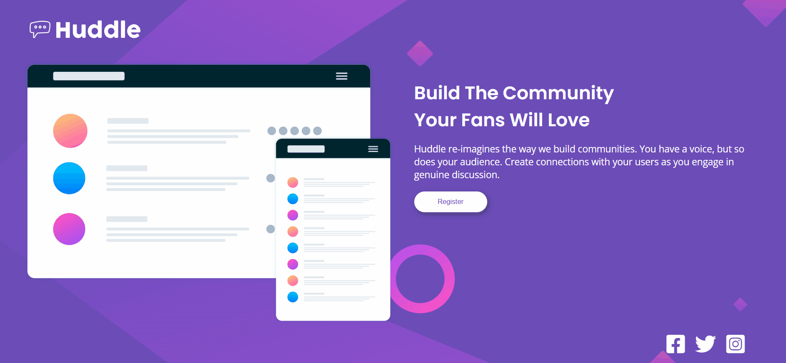

# Quest Dev em Dobro - HTML + CSS avançado

Esta é a solução para o desafio [Huddle landing page with single introductory section challenge on Frontend Mentor](https://www.frontendmentor.io/challenges/huddle-landing-page-with-a-single-introductory-section-B_2Wvxgi0).

## Table of contents

  - [O desafio](#o-desafio)
  - [Screenshot](#screenshot)
  - [Links](#links)
  - [Meu processo](#meu-processo)
  - [Construído com](#construído-com)
  - [O que aprendi](#o-que-aprendi)

### O desafio

Os usuários devem ser capazes de:

- Visualizar o layout ideal para a página, dependendo do tamanho de tela do dispositivo.
- Ver os estados de hover de todos os elementos interativos da página.

### Screenshot

[]

### Links

- Live Site URL: [Add live site URL here](https://your-live-site-url.com)

## Meu processo

O processo foi similar a todos os outros projetos que tenho praticado. Primeiramente demarco e organizo como serão divididas cada parte da página. Utilizei o paint para colocar a marcação em retângulos coloridos, organizando o que entraria em cada div ou sessão. Após realizar a marcação em HTML comecei a estilizar no CSS parte por parte, começando do header indo até o footer. Por último organizei a parte de mobile, usando @media para organizar parãmetros como tamanho de texto e organização das imagens.

### Construído com

- Marcação semântica HTML
- Propriedades do CSS
- Flexbox
- CSS Grid

### O que aprendi

Neste desafio aprendi a ser mais independente para ir atrás de informações que ainda não estão muito fixas, ajudando muito no desenvolvimento do meu aprendizado. Reforcei conteúdos de flexbox, grid e organização de marcações no HTML. Aprendi como usar o @media e deixar meus sites mais responsivos.
